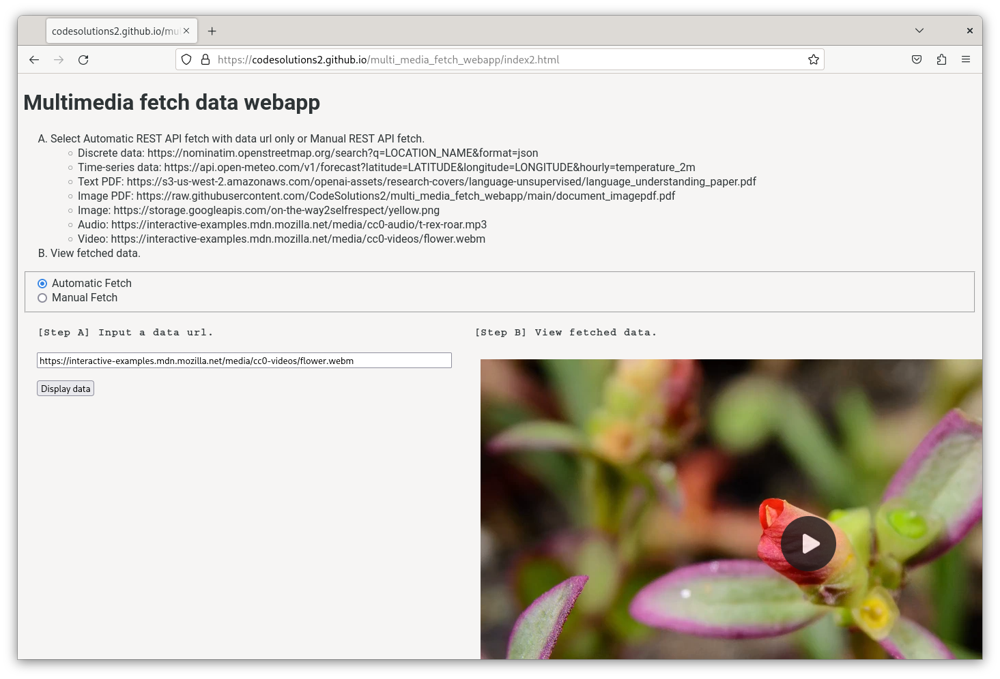

# multi_media_fetch_webapp

The purpose of this webapp is to combine reliable Internet data fetching methods for (CORS, non-CORS) into one application, such that data fetching is not a long and difficult task for AI modeling. The functions in this application can be reused as modules to fetch needed data for model training.

## Multimedia webapp
It was found that the following fetch methods: Image, Audio, Video, fetch, and jQuery, were more reliable in obtaining Internet data from other domains (CORS) than other fetching methods. Thus, this webapp features these five methods for fetching and presenting data on the page.

[Url-to-multimedia display webapp] https://CodeSolutions2.github.io/multi_media_fetch_webapp/index5.html

## Simple GET POST json webapp
[Simple GET POST json webapp] https://CodeSolutions2.github.io/multi_media_fetch_webapp/simple_GETPOST_json_fetch.html

## Upwork
[Available for purchase on Upwork](https://www.upwork.com/services/product/development-it-cors-url-to-multimedia-javascript-custom-webapp-1815412620907616175)
